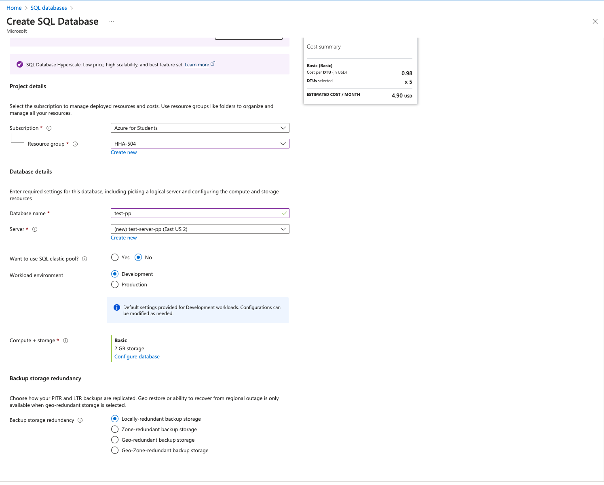

# HHA504_assignment_dbs

### 1. Start and Configure a Managed Database
- Azure MySQL
    
    
    
    

- GCP MySQL
    
    
    

### 2. Explore BigQuery (GCP)
- BigQuery
    
    
    
    

### 3. Monitor Database Services
- Azure
    

- GCP
    
    

## Reflections
- Similar process of creating a SQL instance on both platforms
- Both platforms support automatics backups
- Both platforms emphasize integration with their respective services. For example, App Engine/Compute Engine for GPC whereas Virtual Machines/Web Apps for Azure
- GCP is more user friendly and has less distractions compared to Azure